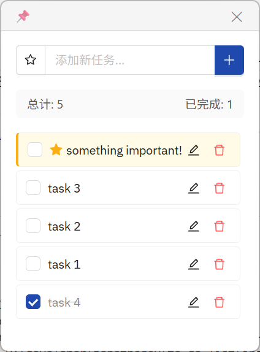
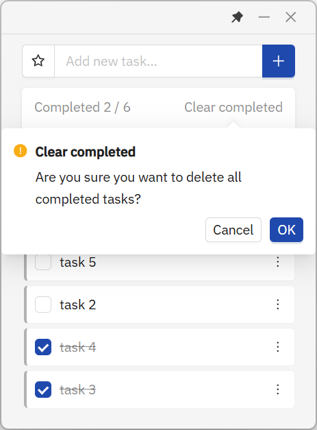

<h1 align="center">
  
  <br>
  QuickTask
  <br>
</h1>

<h3 align="center">
  Lightweight, Fast, and Elegant Desktop Todo App
</h3>

<p align="center">
  Built with Tauri 2 - Small Size, High Performance
</p>

<p align="center">
  <a href="./README.zh-CN.md">简体中文</a> | English
</p>

---

## 📸 Preview

|                                               |                                                |                                                |
| --------------------------------------------- | ---------------------------------------------- | ---------------------------------------------- |
|  |  |  |

## 📥 Download

Get the latest version from [Releases](https://github.com/janethedev/desktop-todolist/releases)

## ✨ Features

- **Quick Add** - Add tasks instantly with keyboard shortcuts
- **Inline Edit** - Double-click to edit tasks in place
- **Priority Tags** - Star important tasks for better visibility
- **Smart Sorting** - Important tasks auto-pinned to top
- **Drag & Drop** - Reorder tasks with drag-and-drop
- **System Tray** - Minimize to tray, always accessible
- **Always on Top** - Pin window above other applications
- **Single Instance** - Prevent duplicate launches
- **Multi-language** - Switch between English and Chinese via tray menu
- **Auto Save** - Your data is automatically persisted

## 🌍 Language Support

- **Default**: English
- **Switch Language**: Right-click tray icon → Language → Select language
- **Supported**: English, 简体中文
- **Persistent**: Language preference saved across sessions

## 🛠️ Tech Stack

**Frontend**
- React 19 + Ant Design 5
- Vite 7
- i18next (Internationalization)

**Backend**
- Tauri 2.8 + Rust
- System tray with submenu
- Single instance plugin

## 🚀 Why Tauri?

| Feature | QuickTask (Tauri) | Electron |
|---------|-------------------|----------|
| 📦 Bundle Size | ~3-5 MB | ~50-150 MB |
| 💾 Memory Usage | ~30-50 MB | ~100-200 MB |
| ⚡ Startup Time | < 1s | 2-5s |
| 🔒 Security | Rust memory safety | JavaScript runtime |

## 💻 Development

### Prerequisites
- Node.js 16+
- Rust 1.77.2+
- Windows: Visual Studio C++ Build Tools

### Quick Start

```bash
# Clone repository
git clone https://github.com/janethedev/desktop-todolist.git
cd desktop-todolist

# Install dependencies
npm install

# Run development server
npm run dev
```

### Build

```bash
npm run build
```

Installer output:
- NSIS: `src-tauri/target/release/bundle/nsis/`
- MSI: `src-tauri/target/release/bundle/msi/`

## ⌨️ Shortcuts

- `Enter` - Add task / Save edit
- `Esc` - Cancel edit
- Double-click task - Edit mode
- Left-click tray - Show/hide window
- Right-click tray - Menu

## 📂 Project Structure

```
QuickTask/
├── src/renderer/
│   ├── App.jsx              # Main component
│   ├── i18n.js              # i18n configuration
│   ├── locales/             # Language files
│   │   ├── en-US.json
│   │   └── zh-CN.json
│   └── components/
│       ├── TitleBar.jsx
│       ├── TodoInput.jsx
│       ├── TodoList.jsx
│       └── TodoStats.jsx
│
└── src-tauri/
    ├── src/lib.rs           # Core logic (tray, i18n)
    └── tauri.conf.json      # Tauri config
```

## 🤝 Contributing

Issues and Pull Requests are welcome!

## 📄 License

[MIT License](LICENSE)

---

<p align="center">
  Made with ❤️ by <a href="https://github.com/janethedev">Jane The Dev</a>
</p>
