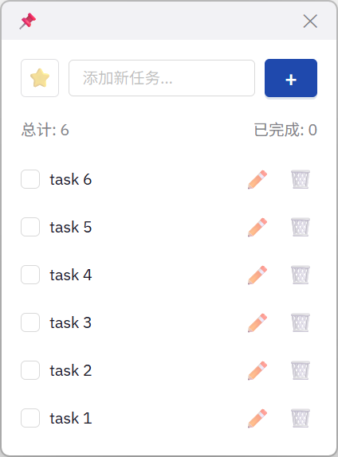

<h1 align="center">
  
  <br>
  QuickTask</a>
  <br>
</h1>

<h3 align="center">
A minimalist to-do list app based on Tauri.</a>
</h3>

## Preview

 

## Install

[Release page](https://github.com/clash-verge-rev/clash-verge-rev/releases)

## Features

- ✅ 添加、编辑、删除待办事项
- ✅ 标记完成/取消完成
- ✅ 重要性标记（⭐）
- ✅ 双击编辑
- ✅ 自定义标题栏
- ✅ 窗口置顶功能
- ✅ 系统托盘图标
- ✅ 单实例锁定
- ✅ 数据持久化
- ✅ 智能排序（重要且未完成优先）

## 技术栈

- **Tauri 2** - 轻量级桌面应用框架
- **React 19** - UI 框架
- **Ant Design 5** - UI 组件库
- **Vite** - 快速构建工具
- **Rust** - 后端语言

## 为什么选择 Tauri？

相比 Electron：
- **更小的体积** - 安装包体积减少 90% 以上
- **更低的内存占用** - 运行时内存使用减少 50% 以上
- **更快的启动速度** - 使用系统原生 WebView
- **更安全** - Rust 后端提供更强的安全保障

## 开发

### 前置要求

- Node.js 16+
- Rust 1.77.2+
- Windows: Visual Studio C++ Build Tools

### 安装依赖

```bash
npm install
```

### 运行开发环境

```bash
npm run dev
```

### 构建生产版本

```bash
npm run build
```

构建完成后，安装包将在 `src-tauri/target/release/bundle/` 目录中。

## 项目结构

```
src/
└── renderer/          # React 前端
    ├── App.jsx        # 主应用组件
    ├── main.jsx       # React 入口
    ├── App.css        # 样式文件
    ├── tauri-api.js   # Tauri API 封装
    └── components/    # 组件目录
        ├── TitleBar.jsx
        ├── TodoInput.jsx
        ├── TodoList.jsx
        └── TodoStats.jsx

src-tauri/             # Rust 后端
├── src/
│   ├── main.rs        # 主入口
│   └── lib.rs         # 核心逻辑
├── Cargo.toml         # Rust 依赖配置
└── tauri.conf.json    # Tauri 配置
```

## 许可证

MIT License
