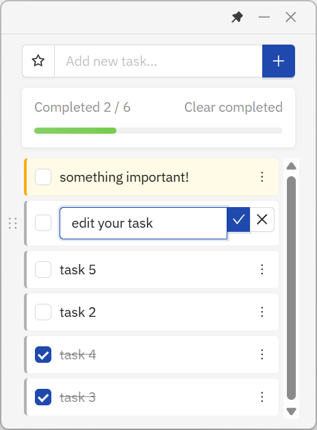

<h1 align="center">
  
  <br>
  QuickTask
  <br>
</h1>

<h3 align="center">
  轻量、快速、优雅的桌面待办事项应用
</h3>

<p align="center">
  基于 Tauri 2 构建，体积小巧，性能卓越
</p>

---

## 📸 预览

|                                               |                                                |
| --------------------------------------------- | ---------------------------------------------- |
|  |  |

## 📥 下载安装

前往 [Release 页面](https://github.com/janethedev/desktop-todolist/releases) 下载最新版本

## ✨ 核心功能

### 📝 任务管理
- **快速添加**：输入框即时添加任务
- **智能编辑**：双击任务文本即可编辑
- **一键删除**：快速清理已完成任务
- **完成标记**：勾选复选框标记完成状态

### ⭐ 优先级管理
- **重要标记**：星标标注重要任务
- **智能排序**：重要且未完成的任务自动置顶
- **视觉区分**：重要任务使用独特背景色高亮显示

### 🎯 用户体验
- **自定义标题栏**：无边框设计，简约现代
- **窗口置顶**：一键置顶，随时查看待办事项
- **系统托盘**：最小化到托盘，不占任务栏空间
- **单实例运行**：防止重复启动，自动聚焦已打开窗口
- **数据持久化**：自动保存，数据永不丢失
- **响应式布局**：窗口大小可调，编辑框自适应宽度

### ⌨️ 快捷操作
- `Enter` - 添加新任务 / 保存编辑
- `Esc` - 取消编辑
- 双击任务 - 进入编辑模式
- 左键托盘图标 - 显示/隐藏窗口
- 右键托盘图标 - 显示菜单

## 🛠️ 技术栈

### 前端
- **React 19** - 最新版 React UI 框架
- **Ant Design 5** - 企业级 UI 组件库
- **Vite 7** - 新一代前端构建工具

### 后端
- **Tauri 2.8** - 轻量级桌面应用框架
- **Rust** - 内存安全的系统编程语言

### 核心插件
- `tauri-plugin-log` - 日志系统
- `tauri-plugin-single-instance` - 单实例锁定
- 系统托盘 - 原生系统托盘支持

## 🚀 为什么选择 Tauri？

相比传统 Electron 应用：

| 特性 | QuickTask (Tauri) | Electron 应用 |
|------|-------------------|---------------|
| 📦 **安装包体积** | ~3-5 MB | ~50-150 MB |
| 💾 **内存占用** | ~30-50 MB | ~100-200 MB |
| ⚡ **启动速度** | < 1 秒 | 2-5 秒 |
| 🔒 **安全性** | Rust 内存安全 | JavaScript 运行时 |
| 🌐 **WebView** | 系统原生 | Chromium 内嵌 |

## 💻 本地开发

### 环境要求

- **Node.js** 16+ 
- **Rust** 1.77.2+
- **Windows**: Visual Studio C++ Build Tools

### 快速开始

1. **克隆项目**
```bash
git clone https://github.com/janethedev/desktop-todolist.git
cd desktop-todolist
```

2. **安装依赖**
```bash
npm install
```

3. **启动开发环境**
```bash
npm run dev
```

应用将自动启动，支持热更新（HMR）。

### 打包发布

```bash
npm run build
```

打包完成后，安装包位于：
- NSIS 安装程序：`src-tauri/target/release/bundle/nsis/`
- MSI 安装程序：`src-tauri/target/release/bundle/msi/`

> **注意**：MSI 打包要求版本号格式为纯数字（如 `1.0.0` 或 `1.0.0-2`）

## 📂 项目结构

```
QuickTask/
├── src/                        # 前端源码
│   └── renderer/              
│       ├── App.jsx             # 主应用组件
│       ├── App.css             # 全局样式
│       ├── main.jsx            # React 入口
│       ├── tauri-api.js        # Tauri API 适配层
│       └── components/         # UI 组件
│           ├── TitleBar.jsx    # 自定义标题栏
│           ├── TodoInput.jsx   # 任务输入组件
│           ├── TodoList.jsx    # 任务列表组件
│           └── TodoStats.jsx   # 统计信息组件
│
├── src-tauri/                  # Rust 后端
│   ├── src/
│   │   ├── main.rs            # 程序入口
│   │   └── lib.rs             # 核心逻辑（命令、托盘、单实例）
│   ├── Cargo.toml             # Rust 依赖
│   ├── tauri.conf.json        # Tauri 配置
│   └── icons/                 # 应用图标
│
├── index.html                  # HTML 模板
├── vite.config.js             # Vite 配置
└── package.json               # 项目配置
```

## 🤝 贡献

欢迎提交 Issue 和 Pull Request！

## 📄 许可证

[MIT License](LICENSE)

---

<p align="center">
  Made with ❤️ by <a href="https://github.com/janethedev">Jane The Dev</a>
</p>
